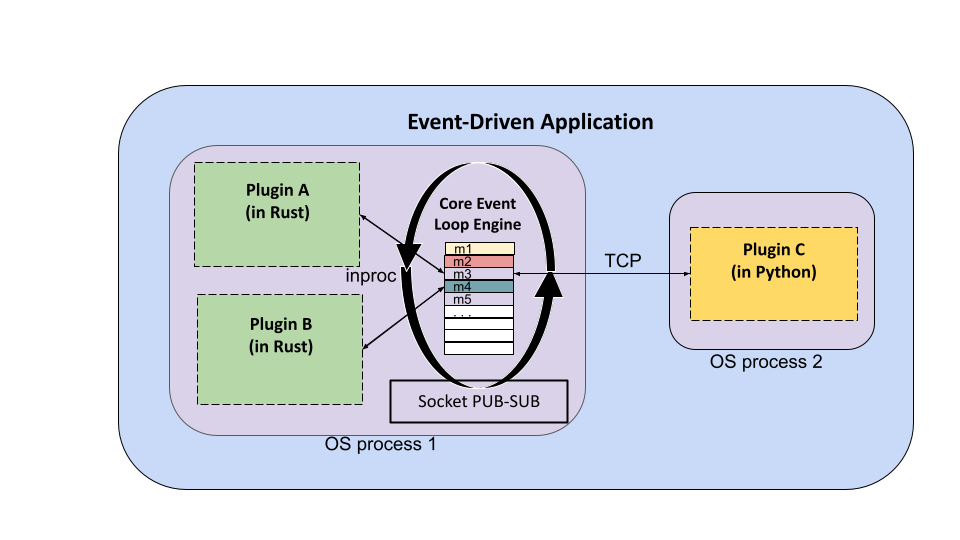

# Event Engine

The `event-engine` project provides a framework for writing event-based applications that utilize a plugin architecture. Applications built with `event-engine` are written in Rust but can include plugins written in multiple languages. 

Events correspond to statically typed messages that can be transmitted over a socket and are the basic 
mechanism of communication between plugins of the application. Each application defines its own event types,
including the mechanisms for serializing and deserializing an event's message to/from bytes. No assumption 
is made about the serialization format used for events, and different event types can utilize 
different formats.

Plugins are independent components of an application that create and consume events. Each plugin defines
the event types it is interested in, and the core `event-engine` proxies event messages to the application's
plugins using a publish-subscribe pattern. 

Plugins can be "internal" or "external". Internal plugins run as child threads within the main (Rust) application process and are necessarily written in Rust. External plugins run as separate OS processes and 
can be written in any language. 

All event message communication happens via `zmq` sockets which `event-engine` manages. Internal plugins 
send and receive event messages using `inproc` sockets while external plugins use TCP sockets.




## Usage

The main steps to building an application using `event-engine` are as follows:

1. Define the `EventType`s and `Event`s for the application. The `events.rs` module includes two traits,
`EventType` and `Event`, to be implemented.
2. Define the plugins for the application. These are the independent components that will create and consume
events. The `plugins.rs` module includes the `Plugin` and `ExternalPlugin` traits to be implemented.
3. Create an `event_engine::App` object and configure it with the plugins for the application. For example,

```
     use event_engine::App;
     // define events and plugins

     // create the App object, register the plugins and run
     fn main() {
         // two Rust plugins
         let msg_producer = MsgProducerPlugin::new();
         let counter = CounterPlugin::new();
         // an external plugin written in python
         let pyplugin = PyPlugin::new();
     
         // main application object
         let app: App = App::new(5559, 5560);
         app.register_plugin(Arc::new(Box::new(msg_producer)))
             .register_plugin(Arc::new(Box::new(counter)))
             .register_external_plugin(Arc::new(Box::new(pyplugin)))
             .run()
             .unwrap();
         ()
     }
```

In the case of external plugins, a small Python module, `events.py`, included within the `pyevents` 
directory of this repository, has been written to simplify the process of writing Python plugins. 
There is also a Docker image, `tapis/pyevents`, which can be used to build a standalone container
with a Python plugin.


## Example

This repository includes a complete example application consisting of two (internal) Rust plugins and
one external Python plugin. The application is packaged as two Docker containers -- the main Rust 
application, with the two Rust plugins, runs in the first container and the Python plugin runs in the second
container. See the `example` directory for more details.

## Design and Architecture 

As mentioned in the introduction, the `even-engine` framework is designed around two primary notions: 
1) events of interest in the application will be described as typed messages that can be transmitted over a socket; and
2) independent application components, referred to as _plugins_, will register events they are interested in 
receiving.

The subsequent sections discuss the design and architecture of `event-engine` in more detail.

### ZMQ Sockets and Publish-Subscribe

ZMQ sockets provide a foundational building block for `event-engine`. The ZMQ socket exposes a single API supporting
multiple transports, including in-process, inter-process and TCP. It also enables a number of advanced messaging 
patterns, such as request-reply and pub-sub, while simultaneously handling issues such as auto-reconnect. 

In ZMQ, all sockets have a type, and socket types tend to work together in pairs. `event-engine` uses two socket 
type pairs to enable its functionality: `PUB-SUB` sockets are used to allow plugins to publish events and receive 
events generated by other plugins, and `REP-REQ` sockets are used to sync all plugins at the start of an application,
to ensure that no plugin misses initial messages that are sent. 

The engine creates socket objects for itself and for each of the plugins. The socket types mirror each other:

  * The engine creates an "outgoing" socket bound to an `inproc` URL and TCP port of type `PUB` for itself, and it 
  creates a corresponding `SUB` socket bound to the same endpoints for each plugin. This is the socket on which plugins
  receive new event messages.

  * Similarly, the engine creates an "incoming" socket bound to an `inproc` URL and TCP port of type `SUB` for itself, and 
  it creates a corresponding `PUB` socket bound to the same endpoints for each plugin. This is the socket on which plugins
  publish new event messages.

  * It creates a "sync" socket of type `REP` that the engine uses and of type `REQ` that each plugin uses for
  synchronization.

Synchronization works in two steps: first, each plugin is started with a `REQ` socket, and it sends a "ready" message on
this socket once it is started. The plugin then blocks, waiting for a reply from the engine. The engine collects a
"ready" message from each registered plugin before sending an "ok" reply (on its corresponding `REP` sockets) to each
plugin. Once a plugin thread has received an "ok" reply, its start function is executed. 


### Interfaces


### Concurrency


## Developing `event-engine`

Working 